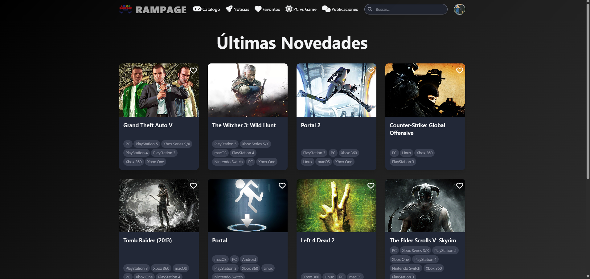
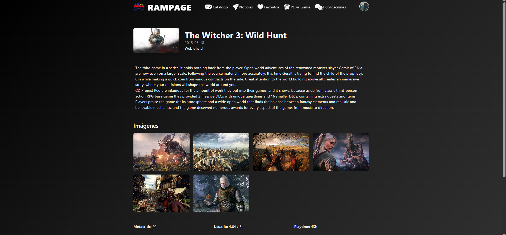
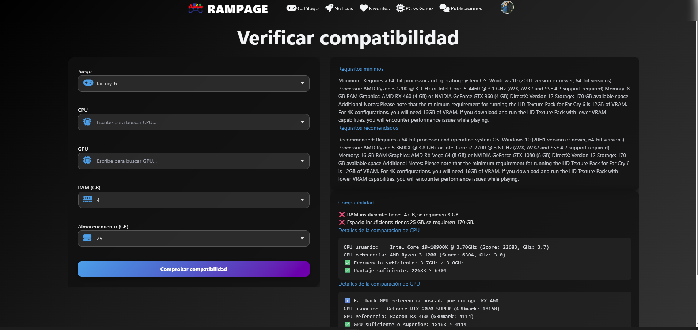
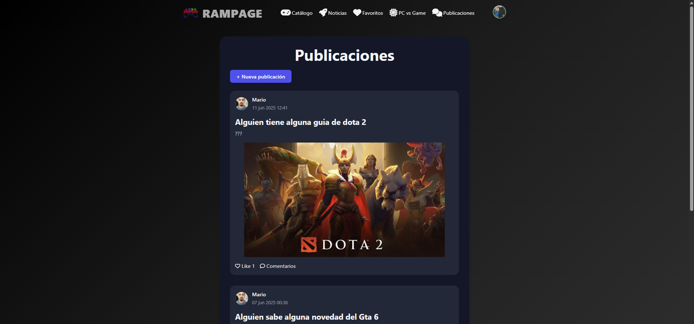
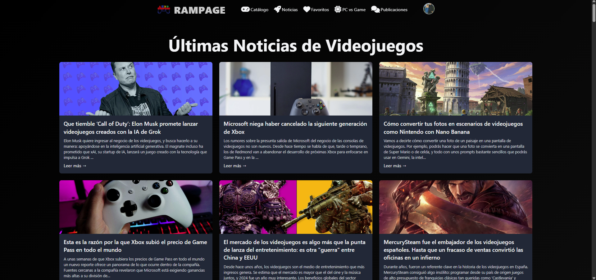

# 🎮 RAMPAGE: Plataforma Integral de Videojuegos & Compatibilidad Hardware

## 📖 Descripción del Proyecto

**Rampage** es una plataforma web Full Stack diseñada para centralizar la experiencia del jugador. Su valor diferencial es un **Comprobador de Compatibilidad de Hardware** en tiempo real que resuelve la incertidumbre de los jugadores de PC ("¿Correrá este juego en mi equipo?").

El sistema compara las especificaciones del usuario (CPU/GPU) contra los requisitos técnicos del juego obtenidos dinámicamente mediante APIs externas.

### 📸 Galería Visual

| **Inicio y Portada** | **Catálogo de Juegos** |
|:---:|:---:|
|  |  |

| **Detalle de Juego** | **Comprobador de Compatibilidad** |
|:---:|:---:|
|  |  |

| **Comunidad y Feed** | **Noticias Gaming** |
|:---:|:---:|
|  |  |

> *El sistema también incluye módulos de seguridad completos con Login y Registro personalizados.*

---

## 🚀 Funcionalidades Clave

### 1. ⚙️ Algoritmo de Compatibilidad (Feature Principal)
* **Base de Datos de Benchmarks:** Sistema propio con puntuaciones de rendimiento (CPU Mark / G3D Mark) para cientos de modelos.
* **Evaluación Lógica:** Algoritmo que parsea los requisitos de texto de la API y los compara matemáticamente con el hardware del usuario para detectar cuellos de botella.

### 2. 🔍 Catálogo y Búsqueda Dinámica
* **Integración API RAWG:** Consumo en tiempo real de metadatos de miles de videojuegos.
* **Búsqueda Asíncrona:** Buscador AJAX para filtrar títulos sin recargar la página.

### 3. 👥 Sistema Social
* **Comunidad:** Los usuarios pueden registrarse, crear publicaciones con multimedia, comentar y dar "Me gusta".
* **Favoritos:** Gestión personalizada de lista de deseos.

### 4. 📰 Noticias Gaming
* **Integración NewsAPI:** Feed automático de actualidad del sector.

---

## 🛠️ Stack Tecnológico

El proyecto sigue una arquitectura **Monolítica MVC (Modelo-Vista-Controlador)** robusta.

### Backend
* **Java 17 & Spring Boot 3:** Núcleo de la aplicación.
* **Spring Security 6:** Autenticación, cifrado **BCrypt** y protección CSRF.
* **Spring Data JPA:** Persistencia e interacción con MySQL.
* **Clientes HTTP:** `RestTemplate` y `WebClient` (Reactivo) para APIs externas.

### Frontend
* **Thymeleaf:** Motor de plantillas servidor.
* **Tailwind CSS:** Diseño responsive utility-first.
* **JavaScript (ES6):** Lógica cliente y Fetch API.

### Datos
* **MySQL 8:** Base de datos relacional para usuarios, posts y hardware benchmarks.

---

## 👨‍💻 Autor

**Mario Larrúa Vega**
